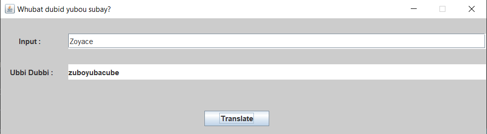

# Ubbi Dubbi Translator

## Screen

## Description

Project will create a graphical element, then after the program will ask you to type a word is goal is to add “ub” in front of any sequence of vowels (‘a’, ‘e’, ‘i’, ‘o’, ‘u’). For example, the word “you” becomes “yubou”. If you enter “This is awesome!” the program will generate :
thubis ubis ubawubesubomube!

## Language

- Java
